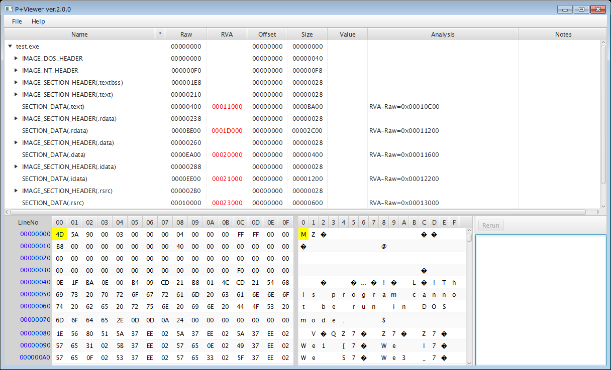

# P+Viewer

PE(Portable Executable) Format File Viewer


## Summary

This tool is PE Format File Viewer.

Few years ago(2015), I created this tool to learn PE Format File.


## Cautions

<font style="color:red;font-size:150%">
This tool needs huge main memory(About 2GB main memory per 1MB file).<br>
Do not open over 1MB file.<br>
</font>


## Installation

This tool can run on an environment that is installed Java8.

- Java version 1.8.0_60(JRE)
    - <font style="color:blue">Note: This tool uses JavaFX 8.</font>


## Example
1. Run
    ```
    java -Xmx4g -jar "P+Viewer2.0.0.jar"
    ```
1. Open File([File]-[FileOpen])


## Screenshot




## Additional Functions

You can use some functions if you input the following key in InputKey Dialog([Help]-[InputKey]).

- Key
    ```
    59bd99714b29f807723ad6aa3c6d9848d14a3074c253b94a1d2f7823ef5c9bf2
    ```
- Additional Functions
    - File Export
    - Binary Edit
    - ReRun


## Develop

I develped this tool on the following environment.

- Windows 8.1 Pro(Japanese)
- Java version 1.8.0_60
- Eclipse IDE for Java Developers Mars.1 Release(4.5.1)
- e(fx)clipse
- JavaFX Scene Builder 2.0
